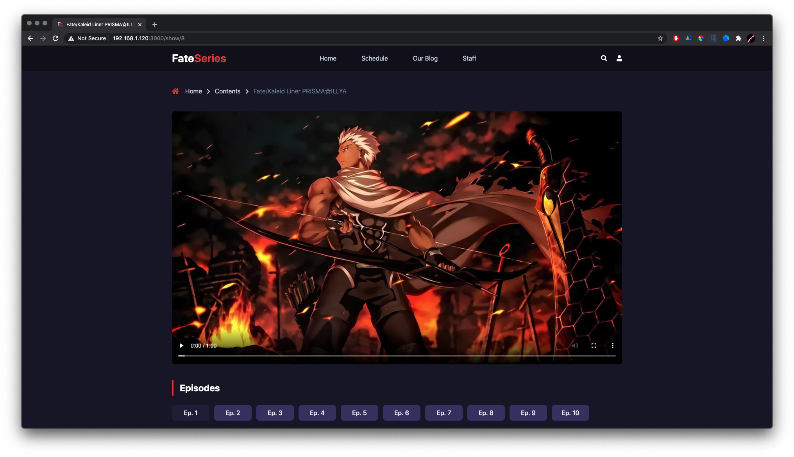

<h1><strong>FATE SERIES</strong></h1>

<h4>Overview: </h4>

    The main case is I'm trying to implement youtube like floating current playing video. Thank's to redux for store the state of video to make the video not killed and still continue when navigating between views.

    Theme inspired from colorlib.

    Do not forget cp .env.exmaple to .env

<h4 style="margin-top: 30px">Stacks Used: </h4>

<ul>
    <li>ReactJS</li>
</ul>

<h4 style="margin-top: 30px">Lib Used: </h4>

<ul>
    <li>Typescript</li>
    <li>Redux</li>
    <li>React Router</li>
    <li>TailwindCSS</li>
    <li>DotENV</li>
    <li>Font Awesome Icon</li>
    <li>Helmet</li>
</ul>

<h4 style="margin-top: 30px">Screenshots: </h4>

 

 

<h4 style="margin-top: 30px">Demo: <a href="https://fate-series.web.app/" target="blank">View</a></h4>
